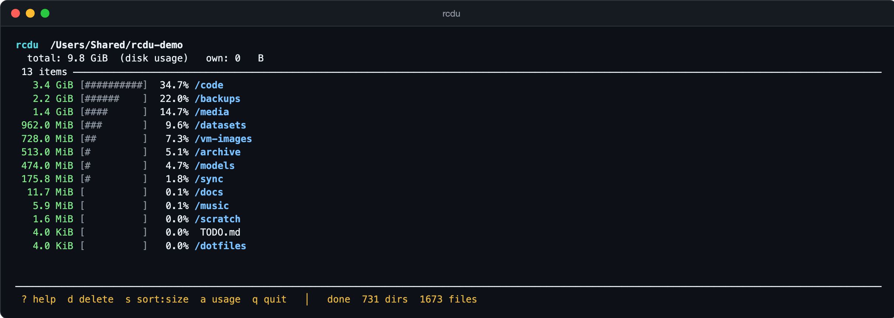

# rcdu

An [ncdu](https://dev.yorhel.nl/ncdu)-style interactive disk usage explorer, in Rust — with two
differences that matter:

1. **Interactive immediately.** It does *not* wait for the scan to finish. The UI opens at once
   and you can browse, sort, and descend into directories while the scan is still running. Sizes
   fill in and aggregate upward live.
2. **Optimized for SSDs.** The scanner is a parallel work-stealing walker (default `cores × 4`
   threads). Directory reads and `lstat` calls are latency-bound, not bandwidth-bound, so keeping
   a deep queue of outstanding I/O lets flash storage overlap thousands of tiny stat latencies.
   (This is the opposite of what you'd want on a spinning disk — and exactly the trade-off ncdu,
   being single-threaded, can't make.)

3. **Navigation steers the scan.** When you enter a directory, its subtree is *prioritized* —
   the scanner finishes the branch you're looking at before unrelated ones, so the sizes you
   care about fill in first. (Pending work is kept in a two-tier "hot/cold" frontier keyed by the
   directory you're viewing.)

It is a **drop-in ncdu replacement**: the common ncdu flags work, and it reads and writes the
ncdu JSON export format, so existing dumps and scripts keep working.

<p align="center">
  
</p>

## Install

```sh
curl -fsSL https://raw.githubusercontent.com/mayankasthana/rcdu/main/install.sh | sh
```

The script detects your platform (macOS Apple Silicon/Intel, Linux x86-64/ARM64), downloads the
static binary from [Releases](https://github.com/mayankasthana/rcdu/releases), verifies its
SHA-256 checksum, and installs it to `~/.local/bin`. Override the destination with
`RCDU_INSTALL_DIR=...` or pin a version with `RCDU_VERSION=v0.1.0`. From source with a Rust
toolchain instead: `cargo install --git https://github.com/mayankasthana/rcdu`.

Already installed? `rcdu update` upgrades in place: it checks GitHub Releases, verifies the
SHA-256 checksum, and atomically replaces the binary (downloads run through `curl`, the same
tool the install script uses). `rcdu update --check` only reports whether a newer release exists.

## Usage

```
rcdu [PATH] [OPTIONS]

ARGS:
    PATH                     directory to scan (default: current directory)

OPTIONS:
    -t, --threads N          scanner threads (default: cores*4, tuned for SSDs)
    -a, --apparent-size      show apparent size (st_size) instead of on-disk usage
    -x, --one-file-system    do not cross filesystem boundaries
        --exclude PATTERN    exclude entries matching a glob (repeatable)
    -X, --exclude-from FILE  read exclude patterns from FILE (one per line)
    -r, --read-only          disable the delete feature
    -o, --output FILE        scan without UI and write ncdu-compatible JSON ('-' = stdout)
    -f, --file FILE          load a tree from ncdu JSON instead of scanning ('-' = stdin)
    -h, --help               show help
    -V, --version            show version
```

Examples:

```sh
rcdu /                          # browse / live, on-disk usage
rcdu ~ --exclude .cache --exclude node_modules
rcdu / -x -o backup.json        # headless scan of the root filesystem only → JSON
rcdu -f backup.json             # browse a previous dump, no scanning
ncdu -o - / | rcdu -f -         # pipe an ncdu scan straight into rcdu
rcdu -f old.json -o new.json    # re-read and rewrite a dump (recomputes totals/dedup)
```

### Keys

| Key | Action |
|-----|--------|
| `j` / `k`, `↓` / `↑` | move selection |
| `l` / `Enter` / `→` | enter directory |
| `h` / `Backspace` / `←` | go up |
| `g` / `G` | jump to top / bottom |
| `PgUp` / `PgDn`, `Ctrl-d` / `Ctrl-u` | page up / down |
| `s` | toggle sort (size ↔ name) |
| `/` | filter entries by name (type to filter live, Enter applies, Esc cancels) |
| `a` | toggle apparent size ↔ on-disk usage |
| `d` | delete selected entry (asks to confirm) |
| `t` | show the largest files under the current directory |
| `r` | rescan the selected directory in place |
| `i` | show details of the selected entry |
| `e` | export the tree to an ncdu-format JSON file |
| `x` | jump to the next read-error entry (`!` marker), wrapping around |
| `o` | open selected entry (default app; directories in the file manager) |
| `?` | show the help dialog |
| `q` / `Esc` | quit |

Row indicators: `/` dir · `@` symlink · `H` hard-link duplicate · `<` excluded · `!` read error.

By default sizes are **on-disk usage** (`st_blocks × 512`); press `a` for apparent size.
Symlinks are never followed (counted as the link itself), matching ncdu's default.

### Filtering

Press `/` and type: the view narrows to entries whose name contains the query
(case-insensitive), and the selection jumps to the first match. While a filter is applied the
title shows `N of M items` and the footer echoes the query with match counts, so a filter is
never silently on. `Enter` applies it (navigation, delete, and open then operate only on the
matches); `Esc` cancels and restores the previous selection. The filter applies to whichever
directory you're viewing until cleared.

### Largest files

Press `t` to see the largest regular files under the directory you're viewing, flattened across
its whole subtree — "what exactly is eating this directory?" without descending level by level.
Sizes follow the active metric (`a` toggles disk usage vs. apparent before opening the popup).
`j`/`k` move, `Enter` jumps to the selected file's parent directory with the file highlighted,
`q` closes. The popup holds the top 100 files as of when you opened it.

### Rescanning in place

Press `r` on a directory to rescan it from disk without restarting: the subtree's current
children are replaced as the new scan streams back in, the entry shows a spinner until it
completes, and the totals of surrounding directories stay correct throughout. Navigation keeps
steering the rescan, so the directory you're viewing fills in first. The same guards as delete
apply: the directory must have finished scanning, only one rescan runs at a time, and a
directory being deleted cannot be rescanned. One limitation: hard links that cross the rescan
boundary (one link inside, another outside the rescanned subtree) are each counted, so totals
can slightly overcount until a full restart.

### Entry details

Press `i` on the selected entry to see its path, type, total and own sizes, the number of
entries for directories, and flags (hard links, exclusions, read errors) — plus, statted
lazily from disk at open time, its permissions, numeric owner, modification time, inode, and
link count. Nothing extra is stored per node, so the tree stays lean; if the path is gone
(deleted mid-session, or a dump whose paths no longer exist) the on-disk section is simply
omitted.

### Deleting

Press `d` to delete the selected file or directory; a confirmation dialog appears first. Two
guards apply:

- **Read-only** (`-r`) disables deletion entirely.
- A directory **cannot be deleted until its whole subtree has finished scanning**. Because the
  scan is live, a directory's size and contents may still be growing; rcdu refuses to delete one
  until every descendant has been read, so you never delete something whose true extent isn't yet
  known. Files are always deletable immediately.

The removal itself runs on a **background thread**, so deleting a huge directory never freezes
the UI: a spinner marks the entry (`[⠋ deleting…]`) and the footer shows progress, while you keep
browsing the rest of the tree normally. Only the subtree being deleted is locked (you can't enter
it), and one deletion runs at a time.

Quitting (`q` / `Ctrl-C`) **while a deletion is running** does not abort it silently: the first
press warns, and a second press force-quits — which interrupts the removal and may leave partial
results (`remove_dir_all` can't be cleanly cancelled). Any other key disarms the prompt.

### Hard links, exclusions, filesystems

- **Hard links** (`nlink > 1`) are detected by `(device, inode)`. Each inode is counted **once**
  toward totals; later links are flagged `H` and shown at their real size but excluded from the
  aggregate — so a tree's grand total isn't inflated by hard links.
- `--exclude PATTERN` matches an entry's **basename** with shell globbing (`*`, `?`, `[...]`).
  Excluded entries stay visible (marked `<`) but are not descended into and don't count.
- `-x` keeps the scan on the root's filesystem; mount points on other devices are shown but not
  traversed.

### ncdu JSON compatibility

`-o` writes the ncdu export format (`[1, 2, {meta}, <root>]`, per-item `asize`/`dsize`, `hlnkc`,
`notreg`, `excluded`, `read_error`), readable by ncdu and other tools. `-f` reads the same format
(including dumps produced by ncdu itself), re-deriving hard-link dedup so totals match a live scan.
Press `e` in the UI to write the currently browsed tree — including deletions made this session —
to `rcdu-dump.json` in the working directory (`rcdu-dump-2.json` and so on if one already
exists), in the same format as `-o`: handy for snapshotting a long scan without redoing it.

## Portable, dependency-free binaries

`rcdu`'s core — scan, sort, delete, JSON import/export — makes **no external process calls**: no
`du`, no coreutils, nothing; it's pure Rust `std`. Two features deliberately shell out: `o` hands
the selected entry to the platform's default handler, and `rcdu update` downloads through `curl`.
The binaries are self-contained:

- **Linux** builds are **fully static musl** binaries: libc is baked in, there are no `.so`
  dependencies and no dynamic loader. Copy to any x86-64 or ARM64 Linux box — Alpine, Ubuntu,
  ancient CentOS, a distroless container — and it just runs.
- **macOS** builds link only `libSystem`/`libiconv`, which are part of every macOS install
  (Apple does not support fully static binaries; this is the portability ceiling on macOS).

Build all three with the bundled script:

```sh
./build-portable.sh        # outputs dist/rcdu-portable-{linux-x86_64,linux-aarch64,macos-<arch>}
```

Prebuilt binaries for every release (Linux x86_64/ARM64 static musl, macOS
Apple Silicon/Intel, plus SHA-256 checksums) are attached to the
[GitHub Releases](https://github.com/mayankasthana/rcdu/releases) page.

The Linux targets are cross-compiled straight from macOS using the toolchain's bundled
`rust-lld` — **no Docker, no zig, no external linker required**.

### Manual builds

```sh
# Native (this machine)
cargo build --release

# Linux static, cross-compiled from anywhere:
LLD=$(find "$(rustc --print sysroot)" -name rust-lld | head -1)
rustup target add x86_64-unknown-linux-musl
RUSTFLAGS="-C linker=$LLD -C linker-flavor=ld.lld -C link-self-contained=yes" \
  cargo build --release --target x86_64-unknown-linux-musl
```

## Design

| Module | Responsibility |
|--------|----------------|
| `scan.rs` | Parallel streaming scanner with a priority frontier (focused subtree first). One `Batch` per directory; hard-link dedup, excludes, one-filesystem. |
| `model.rs` | The tree owned by the UI thread. Lean `Node` (`CompactString` names, derived own-size); grafts batches, propagates *counted* sizes up every ancestor, buffers out-of-order batches, tracks per-subtree "unscanned dirs" for the delete gate, and performs deletion. |
| `glob.rs` | `fnmatch`-style globbing for `--exclude`. |
| `dump.rs` | ncdu-compatible JSON import/export. |
| `app.rs` | App state + key handling, modals (help/confirm), background delete and open. Selection tracks node *identity*, so the highlight doesn't jump as live updates reorder the list. |
| `ui.rs` | ratatui rendering: size bars, percentages, type indicators, popups. |
| `update.rs` | `rcdu update`: self-update from GitHub Releases — fetch latest tag, download the platform asset via `curl`, verify its checksum, atomically replace the binary. |
| `sha256.rs` | Minimal SHA-256 (FIPS 180-4) so update verification needs no external tools or crates. |
| `main.rs` | Args, modes (scan / import / export / update), terminal lifecycle, event loop. |

## Testing

```sh
cargo test
```

The test builds a known directory tree, runs the real scanner to completion, and asserts the
root aggregates every file's bytes for both the apparent and on-disk metrics, with no batch left
buffered — verifying the concurrency and size-propagation logic.

## Status

Implemented: live/progressive parallel scan, SSD-tuned threading, **navigation-prioritized
scanning**, sort, apparent/disk toggle, delete (background, with the still-scanning safety gate,
`-r`, and a guarded Ctrl-C), hard-link dedup, `--exclude` / `-X`, `-x` one-file-system, ncdu JSON
import/export, open (`o`, via the platform's default handler), self-update (`rcdu update`, with
checksum verification), help dialog, a memory-lean node representation, and static portable
binaries.

Possible future work: in-place refresh (`r`) of a subtree, the ncdu "shared/unique" size
breakdown column, and a file-info panel. Further memory wins are available if needed (`u32`
node indices, splitting file/dir storage, a per-tree device table).
